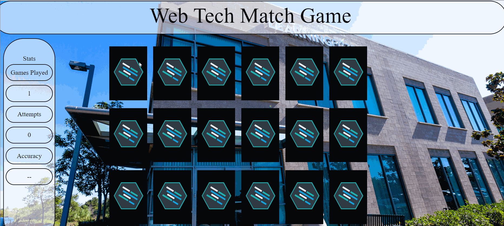

# Web Tech Memory Match

A simple game to test your memory-- match the logos of common web development technologies to win!

## Technologies Used

- JavaScript
- jQuery
- HTML5
- CSS3
- AWS EC2

## Live Demo

Try the application live at [https://memorymatch.slightlyskewedcreations.com](https://memorymatch.slightlyskewedcreations.com)

## Features

- Players can match (or fail to match) cards
- Players can win the game
- Players can view their statistics
- Players can start a new (randomized) game

## Preview



## Development

#### System Requirements

#### Getting Started

1. Clone the repository.

    ```shell
    git clone https://github.com/rbolet/memory-match.git
    cd memory-match
    ```

1. Start the application by opening index.html locally in your browser.
`
